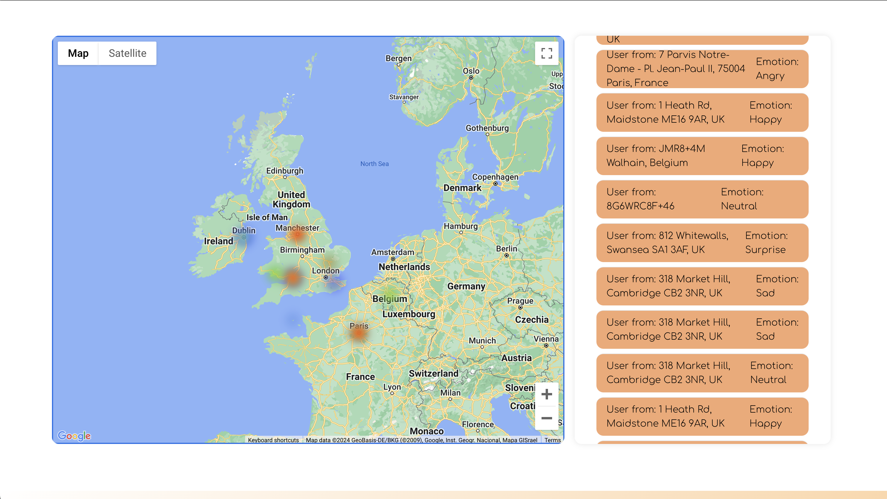

# MoodMap

Welcome to MoodMap, an advanced web application designed for the Brishack 2024 hackathon. MoodMap utilises cutting-edge facial recognition algorithms to interpret and map people's emotions, providing valuable insights into the collective mood of a nation. It is a powerful tool that can be utilised by the government to track the mental health of a population.


## Features

- **Real-Time Emotional Mapping**: MoodMap captures video feed from webcams, livestreams, and videos to create a dynamic representation of the nation's mood in real-time.

- **Emotion Heat Map**: The emotions are visualised as a heat map, providing an intuitive and comprehensive overview of the emotional landscape. Users can identify specific emotions by simply hovering over the heat map.

- **Government Utilisation**: MoodMap serves as a valuable resource for governments to assess and monitor the mental health of the nation. The insights gained can assist in resource allocation for early intervention and support where needed the most.



## Technology Stack

- **Backend**: Developed using the robust and versatile Python programming language.

- **Frontend**: Powered by React to ensure a sleek, interactive, and user-friendly interface. Template courtesy of [Damian](https://github.com/damianstone/react-template).

- **Data Handling**: Firebase is integrated for seamless data handling, ensuring efficient and secure processing of information.

- **Facial Emotion Recognition**: Leveraging the power of TensorFlow for accurate and advanced facial emotion recognition.

- **User Interface**: Tailwind is employed to create a polished and aesthetically pleasing user interface, enhancing the overall user experience.

## Getting Started

1. **Clone the Repository**:
   ```
   git clone https://github.com/MartinOravecSvK/BrisHack2024.git
   ```

2. **Add .env file**

   ```
   cd react_template
   ```

   Add .env with the following variables:

   ```
   REACT_APP_BASE_URL=http://127:0:0:1:8000
   REACT_APP_MODE="development"
   REACT_APP_GOOGLE_MAPS_API_KEY=YOUR-KEY
   REACT_APP_FIREBASE_DATABASE_URL=YOUR-DATABASE-URL
   ```

   Note: 
   
   For secure firebase setup follow the necessary steps, you can do this in the project settings in Firebase (under General).

### Frontend (visualization web app)

1. **Install Dependencies**:

   ```
   cd react_template
   npm install --legacy-peer-deps
   ```

2. **Run the Application**:

   ```
   npm start
   ```

3. **Open Your Browser**:
   Navigate to `http://localhost:3000` to experience MoodMap firsthand.


### Backend

0. **Locate Backend**:

   ```bash
   cd backend/emotionRecog
   ```

1. **Install Dependencies**:

   Using conda:

   ```bash
   cd emotionRecog
   conda env create -f environment.yml
   conda activate brishack24
   ```

2. **Add .env File**:

   .env
   ```bash
   DATABASE_URL=YOUR-DATABASE-URL
   USER_AGENT = USERNAME-FOR-NOMINATIM
   ```

   Note: 
   
   - For secure firebase setup follow the necessary steps, you can do this in the project settings in Firebase (under General).
   - To setup Nominatim simply go to their [website](https://nominatim.org/) and create an account (for more information check their documentation)

3. **Run Emotion Detection**:

   Run emotion.py from within emotionRecog directory.

   ```bash
   python emotions.py   
   ```

4. **Run Countries Simulation**

   If you want you can run a simulation of emotion detected in different countries that is generated through a random process based on the countries statistics.

   ```bash
   python sim.py
   ```

## Contribution Guidelines

We welcome contributions from the community to enhance MoodMap. If you have ideas, bug fixes, or new features, feel free to submit a pull request.

Let's work together to foster connection through shared emotional experiences and create a sense of belonging that transcends geographical boundaries!
